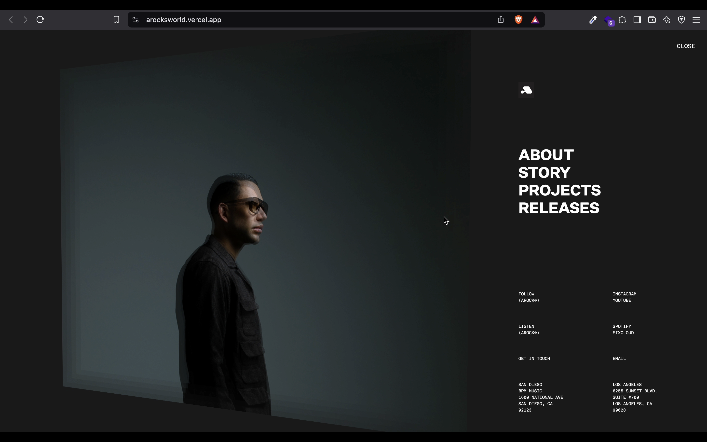

# 🚀 React ArockWorld Portfolio  

Tried **GSAP, Framer Motion, and Tilt.js** to create smooth UI animations and hover effects. This project helped me explore creative web interactions and modern frontend techniques.  

Big thanks to **Sarthak Sharma bhaiya** for the guidance! 🙌  

## 📸 Screenshots  
<!-- Add your screenshots here -->
  
  

## ✨ Features  
- GSAP animations for smooth transitions  
- Framer Motion effects for interactions  
- Tilt.js for 3D hover effects  
- Responsive and modern UI  

## 🔗 Live Demo  
[Live Link Here](https://arocksworld.vercel.app/)  

